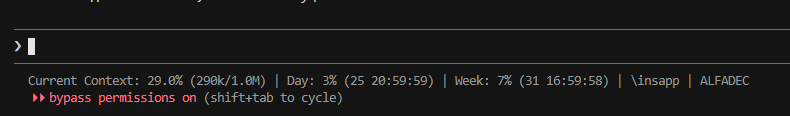

# statusline — статус-бар для Claude Code

Скрипт для строки состояния Claude Code, который показывает:
- **Context** — использование контекстного окна (% и токены)
- **Day** — дневной лимит использования и время сброса
- **Week** — недельный лимит использования и время сброса
- **Папка** — текущая рабочая директория (последний сегмент пути)
- **Сессия** — название текущей сессии (или `_` если не задано)

## Как выглядит



```
Current Context: 29.0% (290k/1.0M) | Day: 3% (25 20:59:59) | Week: 7% (31 16:59:58) | \insapp | ALFADEC
```

| Сегмент | Описание |
|---|---|
| `Current Context: 29.0% (290k/1.0M)` | Использовано 29% контекста (290k из 1M токенов) |
| `Day: 3% (25 20:59:59)` | 3% дневного лимита, сброс 25-го числа в 20:59:59 |
| `Week: 7% (31 16:59:58)` | 7% недельного лимита, сброс 31-го числа в 16:59:58 |
| `\insapp` | Рабочая папка — insapp |
| `ALFADEC` | Название сессии |

## Установка

### 1. Скопируй скрипт

```bash
cp statusline.js ~/.claude/statusline.js
```

### 2. Настрой Organization ID

**Перед установкой** открой https://claude.ai/settings/account и скопируй свой Organization ID — он отображается на странице настроек аккаунта. Пришли его Claude Code, и он сам вставит ID в скрипт.

Или вручную: открой `~/.claude/statusline.js` и замени `YOUR_ORG_ID_HERE` на свой Organization ID (формат: `xxxxxxxx-xxxx-xxxx-xxxx-xxxxxxxxxxxx`).

Если не хочешь настраивать — скрипт будет работать без показа Day/Week лимитов, показывая только контекст, папку и сессию.

### 3. Настрой Cookie-файл

Скрипт использует cookie из файла `~/.claude/claude-cookies.txt` для запросов к Claude.ai API.

**Как получить cookie:**
1. Открой https://claude.ai в браузере
2. DevTools (F12) → Application → Cookies → `claude.ai`
3. Скопируй значение `sessionKey`
4. Создай файл:

```bash
echo "sessionKey=ТВОЙ_SESSION_KEY;" > ~/.claude/claude-cookies.txt
```

Cookie автоматически обновляется при ответах API (через `set-cookie`).

### 4. Подключи в settings.json

Добавь в `~/.claude/settings.json` (или `settings.local.json`):

```json
{
  "statusLine": {
    "type": "command",
    "command": "node ~/.claude/statusline.js"
  }
}
```

На Windows путь будет:
```json
{
  "statusLine": {
    "type": "command",
    "command": "node C:/Users/USERNAME/.claude/statusline.js"
  }
}
```

### 5. Перезапусти Claude Code

Статус-бар появится в нижней части терминала.

## Настройка

### Без Day/Week лимитов

Если не нужны лимиты (или нет cookie) — просто не меняй `YOUR_ORG_ID_HERE`. Скрипт покажет:

```
Current Context: 29.0% (290k/1.0M) | Day: - | Week: - | \insapp | ALFADEC
```

### Частота обновления

Кэш лимитов обновляется каждые 30 секунд (`CACHE_TTL = 30000` мс). Можно изменить в скрипте.

## Требования

- **Node.js** (обычно уже установлен вместе с Claude Code)
- **curl** (для запросов к Claude.ai API, есть на всех ОС)
- Claude Code CLI
